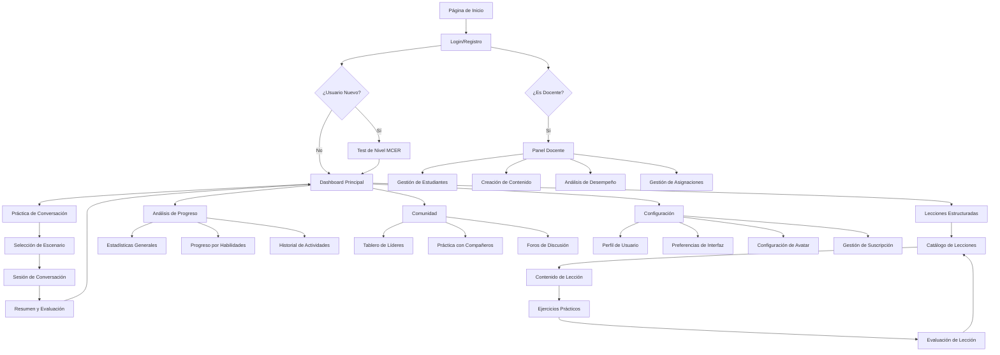
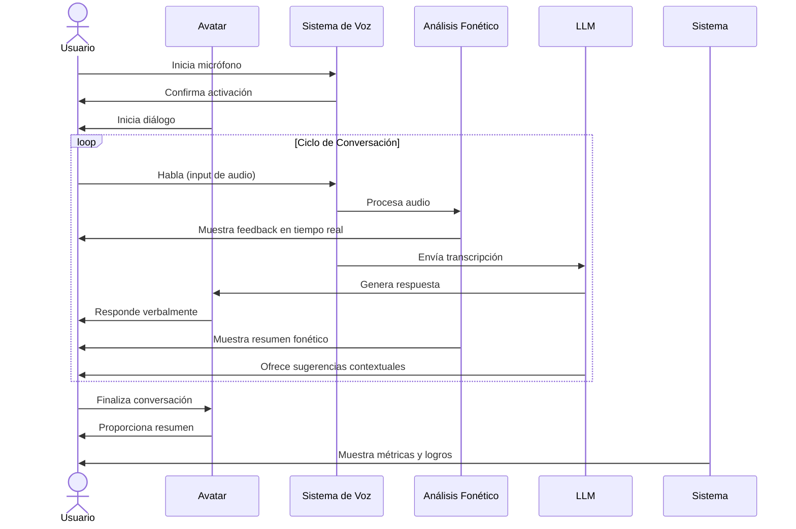
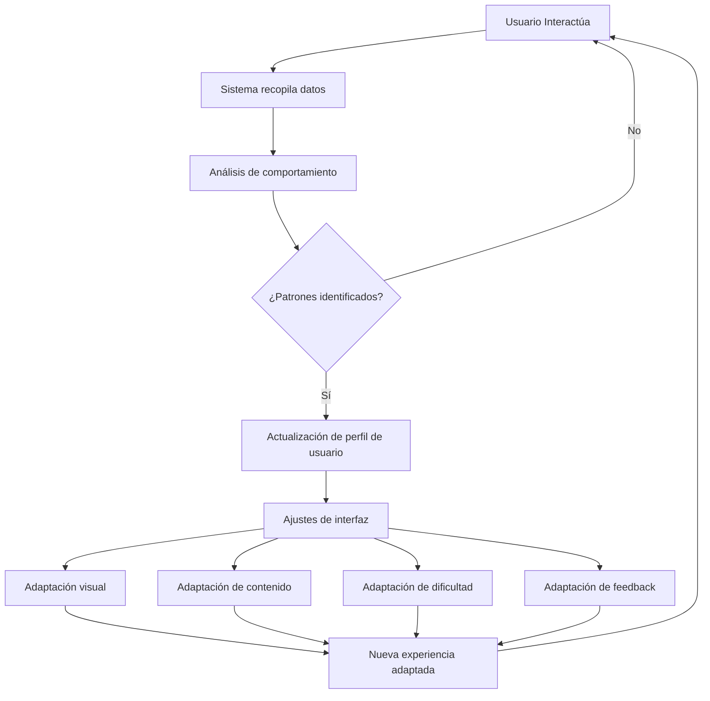
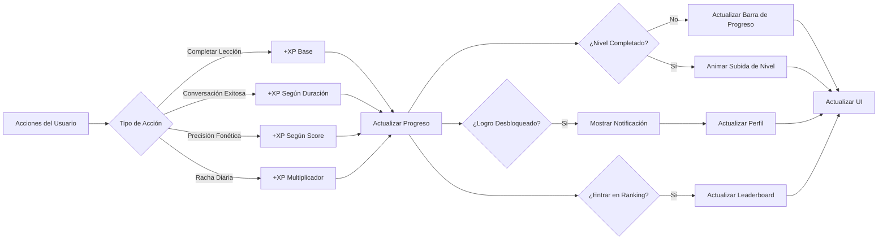
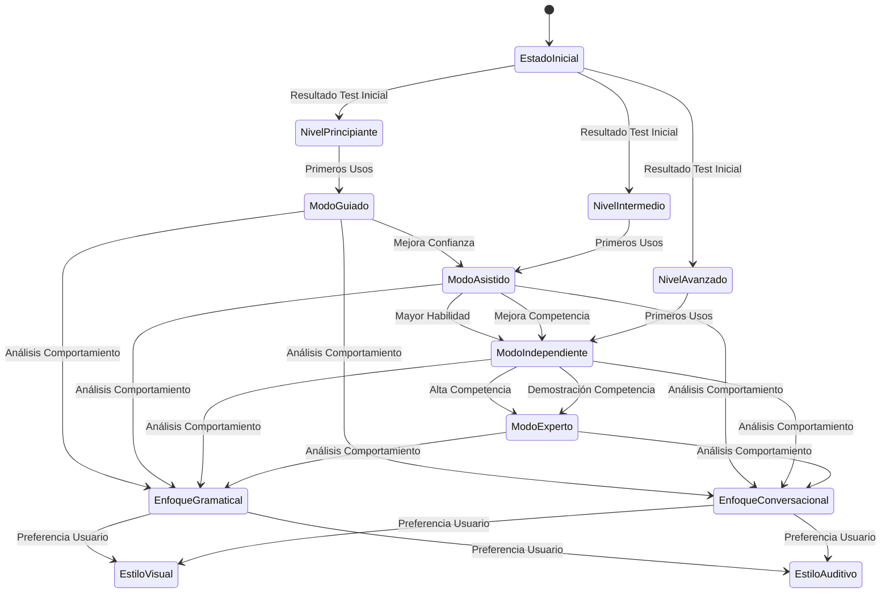
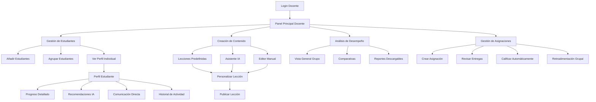
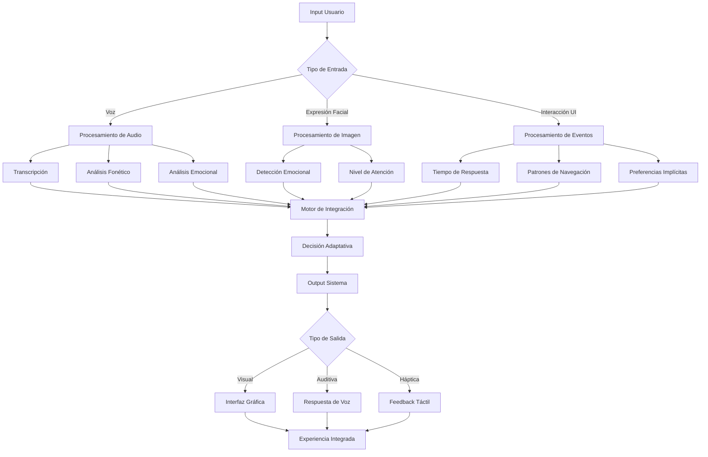

# Diagrama de Interacciones

Este documento presenta el flujo de navegación e interacción entre las diferentes pantallas y componentes del "Tutor Personalizado del Idioma Inglés con Interfaces No Convencionales".

## Mapa de Navegación Principal

## Diagrama Detallado de Interacciones en Sesión de Conversación

## Flujo de Adaptación de Interfaz

## Interacciones del Sistema de Gamificación

## Mapa de Estados de Interfaz Adaptativa

## Interacciones Modo Docente

## Detalle de Interacciones Multimodales

## Nota sobre Implementación

Los diagramas presentados representan el diseño conceptual del sistema y sus interacciones. La implementación técnica seguirá estos flujos, adaptándose según necesidades específicas de desarrollo y retroalimentación de usuarios durante las fases de prueba.

Durante el desarrollo del MVP, se priorizarán las interacciones marcadas en el primer diagrama de flujo, específicamente las rutas principales de navegación y la funcionalidad core de práctica de conversación.
