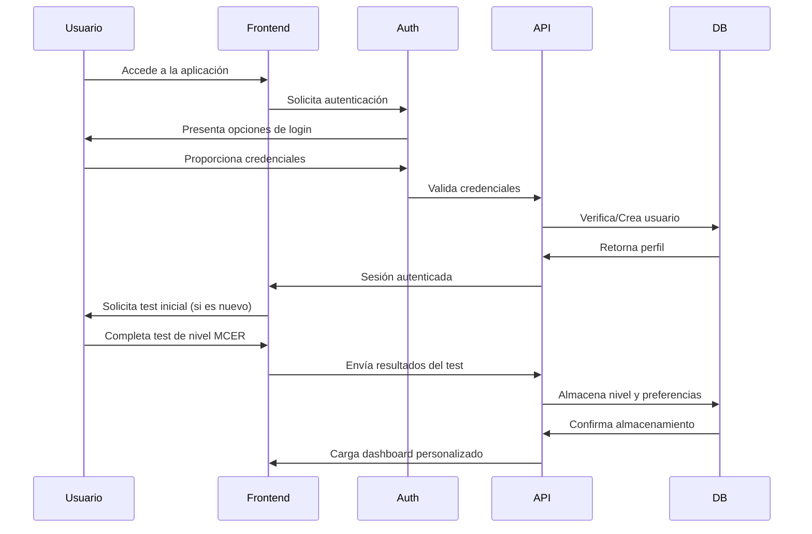
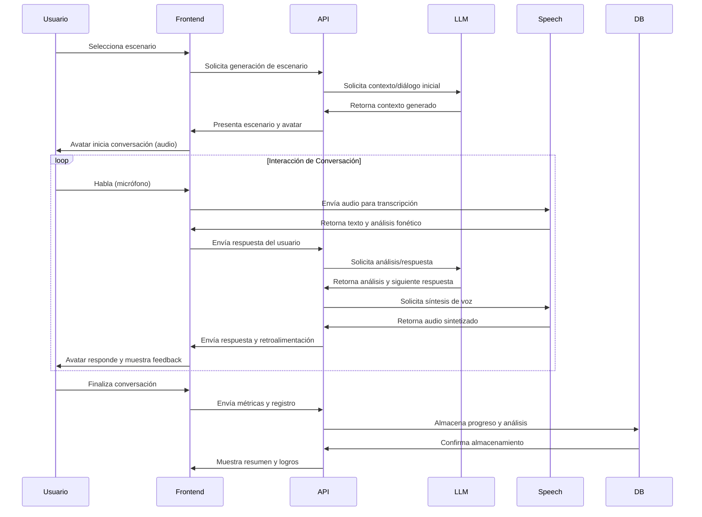
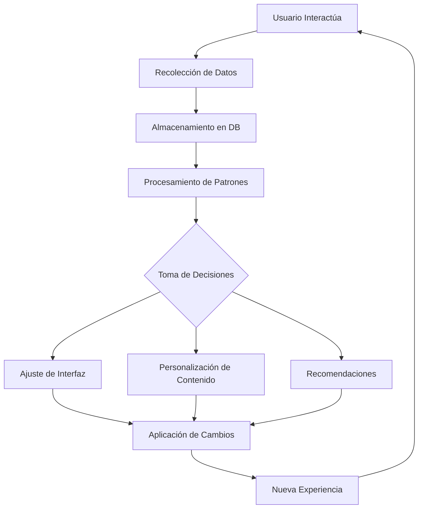
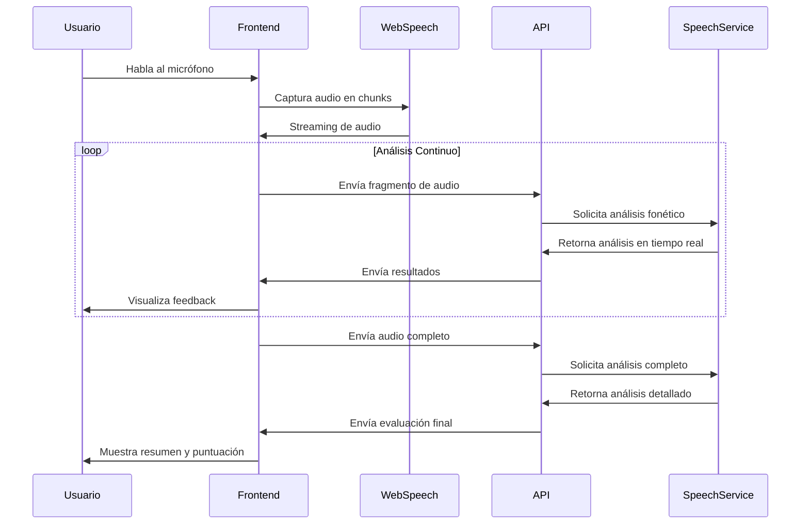
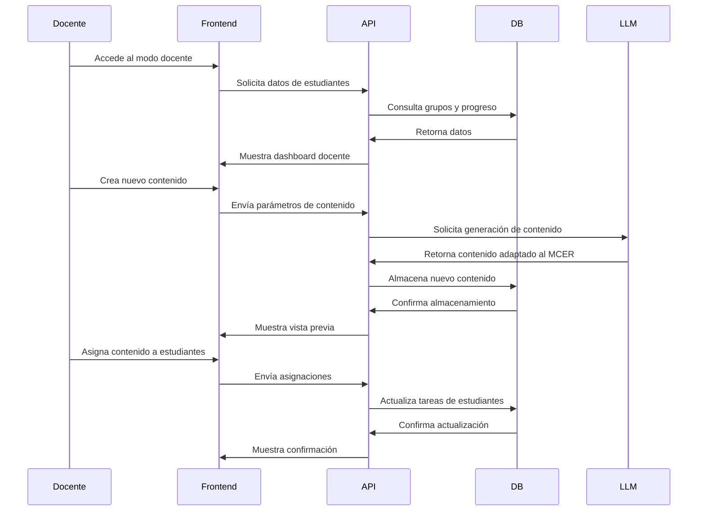
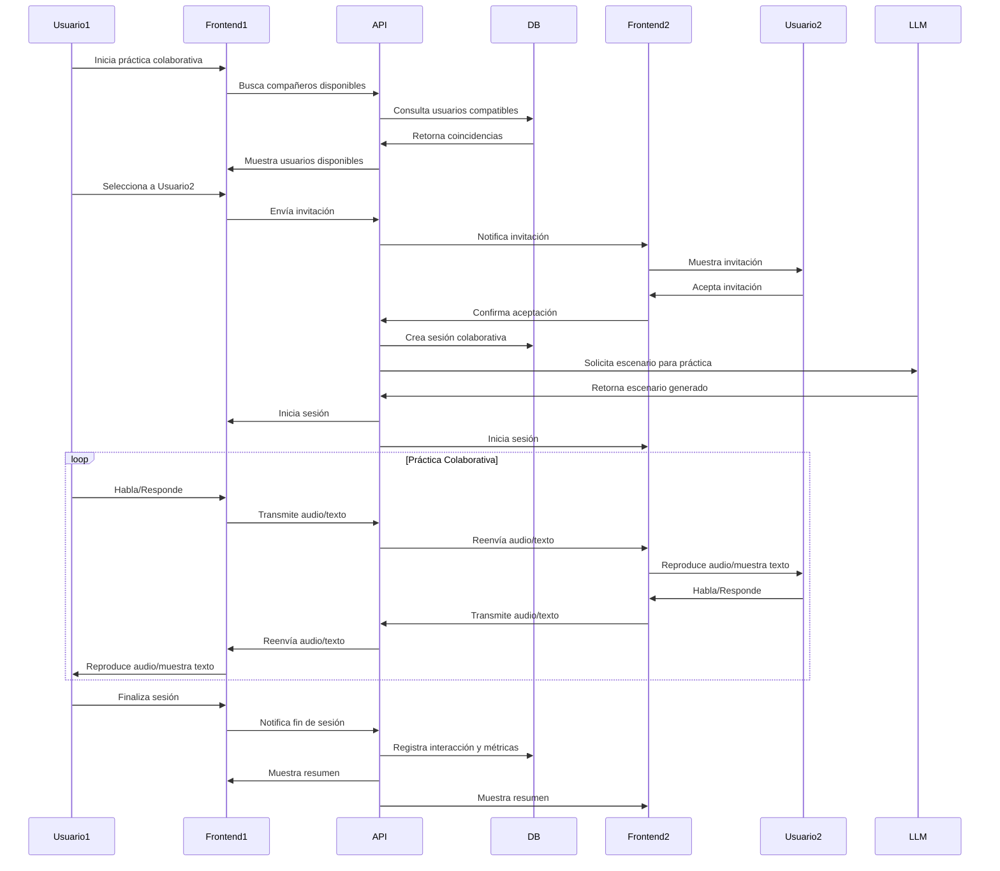
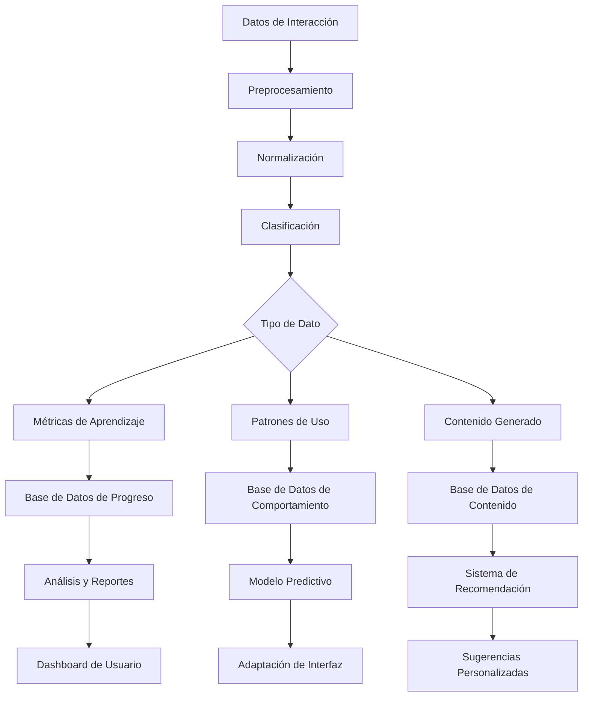

# Flujos de Datos

Este documento describe los principales flujos de datos en el "Tutor Personalizado del Idioma Inglés con Interfaces No Convencionales", mostrando cómo la información se transmite entre los diferentes componentes del sistema.

## 1. Flujo de Autenticación y Configuración Inicial

## 2. Flujo de Práctica de Conversación

## 3. Flujo de Adaptabilidad e Inferencia

## 4. Flujo de Análisis Fonético en Tiempo Real

## 5. Flujo de Datos para Modo Docente

## 6. Flujo de Interacción entre Usuarios

## 7. Flujo de Procesamiento y Almacenamiento de Datos

## Consideraciones de Seguridad y Privacidad

- **Datos Sensibles**: Las transmisiones de audio y datos personales se cifran en tránsito y en reposo.
- **Anonimización**: Los datos utilizados para entrenamiento y mejora se anonimizan previamente.
- **Retención**: Política clara sobre períodos de retención de datos de conversación y audio.
- **Consentimiento**: Sistema de opt-in para grabación y uso de interacciones con fines de mejora.
